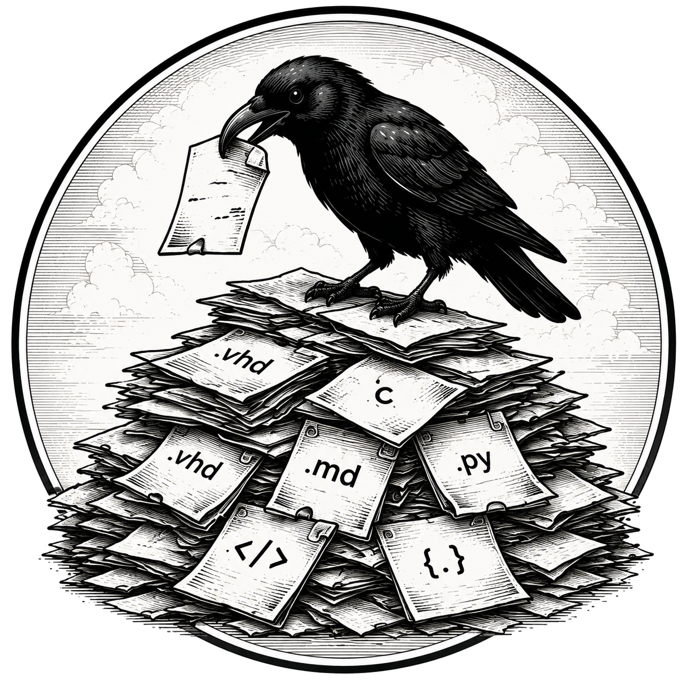

<p align="center">
  
</p>

# corvidex-mcp

**An RTL-centric RAG and indexing MCP.**

An MCP (Model Context Protocol) server that gives coding agents
high-quality semantic search over an organization's HDL code (VHDL,
Verilog, SystemVerilog), HDL-related documentation, and general source
code (C/C++, Python, ...) — all cross-referenced, all with exact
source attribution.

Runs as an MCP server over stdio (installed from this Git
repository with `uvx`, see [Quick start](#quick-start)). No external
services required: the vector store (SQLite + the sqlite-vec
extension) runs embedded and the embedding models run locally (ONNX
via FastEmbed). **Zero configuration required**: point your MCP client
at it and it indexes the directory you started your agent in.

## Intended use

The main uses are **RAG** and **cross-referencing code against
documentation**, for coding agents (Claude Code, Maki, or any MCP
client) that implement or modify HDL (VHDL, Verilog, or
SystemVerilog).

**RAG (Retrieval-Augmented Generation).** RAG is a technique for
keeping a language model grounded in *your* material instead of only
its training data: before (or while) the model generates an answer, it
first *retrieves* relevant chunks from a knowledge base and uses those
as context. For a coding agent, that means the context it needs
usually lives *outside* the file it is editing — the company's coding
standards, design guides, and reference IP from earlier projects.
`corvidex-mcp` is that retrieval layer: it maintains an up-to-date,
semantically searchable index of your repositories and hands the
agent the verbatim text (with exact repository, file, line range, and
commit) of every match, so the agent grounds its work in what the
organization actually wrote instead of hallucinating a plausible
pattern.

**Cross-referencing code against documentation.** This is what makes
the search more than three separate indexes: every chunk stores the
identifiers it defines or references (`symbols`), so the agent can
bridge the domains — and the HDL languages: a constant shared by a
SystemVerilog package, a Verilog module, and a VHDL entity is found
once and resolves to all of them. A standard that says
"asynchronous resets are named `rst_n`" can be checked against the
VHDL that actually uses `rst_n` and the C testbench that drives it; a
signal renamed in the RTL can be found in every doc section and test
function that still references the old name. In practice that means:

- **Docs → code.** Follow a convention from the standard to every
  VHDL construct and test function that implements it.
- **Code → docs.** Find the design rationale behind an implementation:
  given a process or function, which documentation section explains
  its convention.
- **Consistency.** Trace one identifier (e.g. `wr_ptr`) across
  standard, RTL, and testbench so a rename or protocol change doesn't
  leave the domains out of sync.

Both uses rely on the index staying current: repositories are Git
synced (branch-tracked or pinned to a tag/SHA) automatically in the
background, so the context an agent retrieves reflects the code as it
is, not a stale snapshot.

## Capabilities

- **Three indexed domains, one server.** HDL source (VHDL, Verilog,
  and SystemVerilog in one `hdl` collection, each chunk tagged with
  its language), documentation (Markdown/reST/text), and general code
  (C/C++, Python, ...) live in three SQLite collections (a vec0
  vector table + an FTS5 full-text table each). Every query runs a
  hybrid (dense + full-text, RRF-fused) search: semantic similarity
  *and* exact identifier matching in one call. Ask about `rst_n` and
  you get it.
- **Query expansion and reranking.** Queries are expanded with a
  static RTL/HDL synonym lexicon before search (`clock` also matches
  `clk`, `generic` also matches `parameter`, ...), and the fused
  candidates are reranked by a cross-encoder for higher precision than
  RRF fusion alone — both on by default and both degrade gracefully
  (a reranker that isn't provisioned yet falls back to the unreranked
  ranking rather than failing the search).
- **HDL-aware chunking.** VHDL files are chunked per construct
  (entity, architecture, process, package, function, component) using
  the [vhdl_ls](https://vhdl-lang.org/) language server
  (`documentSymbol` with exact line ranges); Verilog and SystemVerilog
  are chunked by [Veridian](https://github.com/chipsalliance/veridian)
  (module/program/interface, package, inner functions and tasks,
  normalized to the same cross-language model — module → `design_unit`,
  `always_ff` → `process` — with the server-native kind kept as
  `native_symbol_kind`). Both have a structural line-scanner fallback
  for files with syntax errors, and a whole-file last resort so no HDL
  is ever lost.
- **Structure-aware chunking elsewhere.** Documentation is chunked per
  heading section; general code is chunked per top-level
  function/class by tree-sitter (any language with a grammar), with
  file-scope gap chunks for uncovered top-level code.
- **Cross-referencing.** Every chunk payload stores the identifiers it
  defines or references (`symbols`). Search tools accept a `symbols`
  filter that matches chunks referencing the given identifiers —
  bridging docs ↔ HDL ↔ test code (e.g. find every construct that
  touches `fifo_write`), and across HDL languages (e.g. `FIFO_DEPTH`
  in a VHDL generic, a Verilog localparam, and an SV package constant).
- **Optional HDL analyzers, graceful degradation.** `vhdl_ls` and
  Veridian are external binaries that are *not* bundled or installed by
  this server: each is located via its config path or on `PATH`, and
  when one is missing its files simply fall back to structural/generic
  parsing. `repository_status` reports each analyzer's availability,
  version, and mode (`lsp` or `fallback`).
- **Exact source attribution.** Every result names repository, file,
  line range, and commit; `get_source` returns the exact current file
  (or a line range) from the synced working tree.
- **Incremental, self-maintaining index.** Repositories are synced
  from Git (clone/fetch/diff): only changed files are re-chunked and
  re-embedded. A background task keeps everything up to date; the
  tools can force a sync or a full reindex at any time.
- **Graceful degradation.** Failures are contained per repository and
  recorded in state; a broken repository never blocks the others or
  the server. A missing language-server binary degrades that analyzer
  to structural parsing (see above) instead of failing.
- **Stdout is protocol-clean.** All logging goes to stderr and a
  rotating log file, so the server is safe to run from any MCP host.

## Quick start

Requirements: [uv](https://docs.astral.sh/uv/) (for `uvx`), Python ≥
3.12, and Git. `vhdl_ls`/Veridian are optional (VHDL/Verilog files
fall back to structural parsing without them). See
[docs/configuration.md](docs/configuration.md#requirements) for the
full platform matrix, and
[Installation](docs/configuration.md#installation) for the PyPI and
air-gapped paths in full.

On Apple Silicon, Python 3.14 needs macOS 14+ (every `onnxruntime`
wheel for CPython 3.14 is tagged `macosx_14_0_arm64`); 3.12 and 3.13
resolve to an older onnxruntime that still supports macOS 13.

Register the server with your MCP client — no config file needed.

Claude Code, from PyPI:

```console
$ claude mcp add corvidex-mcp -- uvx corvidex-mcp
# or install it into the current environment:
$ pip install corvidex-mcp
```

…or straight from this repository:

```console
$ claude mcp add corvidex-mcp -- uvx --from git+ssh://git@github.com/ru551n/corvidex-mcp.git corvidex-mcp
```

Maki (TOML config — verify the exact table names against your Maki
version's docs):

```toml
[mcp_servers.corvidex_mcp]
command = "uvx"
args = ["corvidex-mcp"]
# ...or from git: ["--from", "git+ssh://git@github.com/ru551n/corvidex-mcp.git", "corvidex-mcp"]
```

The PyPI wheel is **slim** (1.3 MB): it downloads the embedding and
reranker models (~0.86 GB) into its data directory on first run. For a
host with no network at all there is a separate **offline bundle** —
one 607.6 MB archive with all three models embedded in the wheel, a
dependency wheelhouse, an installer, and a self-verification command.
It is **not on PyPI**: PyPI's 100 MB per-file limit is not raised for
bundled model weights, so the bundle is published as a
[GitHub Release](https://github.com/ru551n/corvidex-mcp/releases) asset
instead. See
[Air-gapped installation](docs/configuration.md#air-gapped-installation-offline-bundle).

That's it: **the server indexes the directory it is started in.**
Since your MCP client normally spawns it with your project as the
working directory, starting your agent inside your repository is
enough — a Git checkout is indexed as its working tree (HEAD plus
uncommitted and untracked changes), a plain directory as a bag of
files. Confirm what got indexed with the `repository_status` tool.

If you run the server from a local checkout rather than `uvx`, use
`uv --project /path/to/corvidex-mcp run corvidex-mcp` and **not**
`uv --directory ...`: `--directory` changes the working directory, so
corvidex ends up indexing its own source tree instead of your code. Set
`CORVIDEX_MCP_PROJECT_DIR` to your workspace root if a launcher gets
this wrong and cannot be changed.

Don't want that? Disable it with `--no-index-cwd` on the command line,
or `index_cwd = false` in the config file, and run with an empty index
until you configure `[[repositories]]` explicitly. Need more than the
current directory — multiple repositories, a remote Git URL, a
coding-standards file, tuned embedding settings? See
**[docs/configuration.md](docs/configuration.md)**; add a `.corvidex`
config file in the project's root (or point `--config`/
`CORVIDEX_MCP_CONFIG` elsewhere) and any `[[repositories]]` you
configure there take over from the zero-config default.

## Usage

### Tools

| Tool | What it does |
| --- | --- |
| `search_hdl(query, limit, repository, symbols, language, mode)` | Search over HDL source (VHDL, Verilog, SystemVerilog): design units (entities/modules), architectures, processes/always blocks, packages, functions, tasks. `language` filters by HDL language. |
| `search_vhdl(query, limit, repository, symbols)` | `search_hdl` restricted to VHDL (back-compat name). |
| `search_docs(...)` | Same over documentation sections. |
| `search_code(...)` | Same over general code units (functions/classes). |
| `search_knowledge(query, limit, ...)` | All three domains at once, RRF-fused. |
| `get_source(repository, file, start_line, end_line)` | Exact current file content (or a slice) with commit attribution. |
| `find_definition(repository, file, line, character)` | Exact, LSP-backed go-to-definition (`vhdl_ls`/Veridian), not similarity search. `line`/`character` are 0-based; results render as 1-based `path:line:col`. |
| `find_references(repository, file, line, character, include_declaration)` | Exact, LSP-backed find-references for a symbol at a known position. |
| `hover_info(repository, file, line, character)` | Exact, LSP-backed hover: the analyzer's own signature/type/doc text for the symbol at a position. |
| `find_symbol(query, repository?, limit)` | Exact, LSP-backed `workspace/symbol` name lookup, across one or every configured repository. |
| `repository_status()` | Per repository: ref, priority, domains, last indexed commit, last sync, last error — plus the HDL analyzer status (`vhdl_ls`, Veridian: available, version, `lsp`/`fallback` mode) and the per-collection embedding-model state. |
| `sync_repositories(repositories?)` | Incremental sync (default: all). Failures contained per repository. |
| `reindex_repository(repository)` | Drop and rebuild one repository's index. |

All search tools take an optional `repository` (name) filter plus
`symbols: list[str]` — restrict results to chunks referencing any of
the given identifiers. `search_hdl`/`search_knowledge` additionally
accept `language` (e.g. `"verilog"`) to restrict results by language.
Every search tool also takes `mode`: `hybrid` (default; semantic +
full-text, RRF-fused), `semantic` (embedding similarity only), or
`lexical` (full-text match only; no embedding involved). Results are
rendered as markdown with source attribution, score, language, and
referenced identifiers; HDL content is fenced by language.

#### What a result looks like

Each hit quotes the matched chunk with a **1-based line-number gutter**
(the same numbering `get_source` uses), capped at **40 lines**. When the
chunk is longer, the last body line is the exact follow-up call for the
rest — nothing has to be reconstructed by hand:

```vhdl
  595 | architecture rtl of fifo is
  596 |   signal wr_ptr : unsigned(ADDR_W-1 downto 0);
…
… 158 more lines — get_source("common-ip", "rtl/fifo.vhd", 635, 792) for the full text
```

The displayed numbers are 1-based; `find_definition`, `find_references`
and `hover_info` take **0-based** lines, so a line displayed as `N` is
passed to them as `N - 1`.

Two more things the response tells you:

- `score` is the cross-encoder reranker's relevance in `0..1` when
  reranking is available (comparable across queries) — otherwise the
  store's rank-fused score, which is only comparable within one
  response. When the best reranked hit scores below ~0.05 the response
  opens with a line saying so and points at `find_symbol` (exact names)
  or a rephrased query, instead of silently handing back eight junk
  hits.
- A "more matches exist beyond `limit`" note is appended only when
  further candidates really were found — never merely because the page
  is full.

Results nested inside a better-ranked result of the same file (a
process inside the architecture that contains it) are dropped, so one
response never quotes the same lines twice and the freed slot goes to a
different file.

Example agent flow:

1. `search_knowledge("asynchronous reset conventions")` → a docs
   section plus VHDL and Verilog constructs that implement resets.
2. `search_hdl("reset", symbols=["rst_n"])` → every HDL chunk touching
   `rst_n`, in every HDL language.
3. `search_hdl("fifo", language="systemverilog")` → only SystemVerilog.
4. `get_source("company-standards", "rtl/reset_ctrl.vhd", 12, 40)` →
   the exact lines to copy.

### Still indexing?

The server starts serving immediately; it does not wait for the
initial sync to finish (that can take a while for a large repository —
files need to be parsed, chunked, and embedded). While a repository
hasn't completed its first sync yet, or is being (re)synced right now,
search results start with a line like:

```
Note: currently syncing: my-repo. Results may be thin or incomplete; try again shortly.
```

Treat it as a cue to wait a few seconds and retry, not as "nothing
exists". Use `repository_status` to check indexing progress (and
whether a sync is failing outright rather than just running).

## Configuration

Zero configuration is required (see [Quick start](#quick-start)). Once
you need more — multiple repositories, a remote Git URL, a
coding-standards file, embedding-model tuning, air-gapped installs —
see **[docs/configuration.md](docs/configuration.md)** for the full
config file reference.

## Development

```console
$ uv sync
$ uv run ruff format -q . && uv run ruff check .   # format + lint
$ uv run mypy src                                   # strict types
$ uv run pytest -q                                  # offline test suite
```

The test suite runs fully offline: local `file://` git remotes, fake
LSP server scripts (vhdl_ls *and* Veridian), and fake embedding
providers (real-binary tests are gated on the `VHDL_LS_TEST_BIN` and
`VERIDIAN_TEST_BIN` environment variables).

CI (`.github/workflows/ci.yml`) runs on every push to `main` and on
pull requests: `ruff format --check`, `ruff check`, `mypy` (strict),
and the full test suite on Ubuntu and Windows (Python 3.12/3.13/3.14)
and macOS (CPython 3.14: uv's standalone 3.12/3.13 macOS interpreters
lack SQLite loadable-extension support, so the store-dependent tests
would skip wholesale there), plus RHEL 9 and RHEL 10 container jobs
(official UBI images; UBI 9's glibc 2.34 is the strictest floor in
the dependency wheel set).

Layout:

```
src/corvidex_mcp/
  config.py        typed config (pydantic) + default template
  state.py         atomic repository sync state (schema-versioned)
  git_manager.py   async clone/fetch/checkout + incremental SyncPlan
  routing.py       extension -> domain classification (+domains/excludes)
  lsp/             LSP transport (server-agnostic) + vhdl_ls and Veridian
                   adapters + analyzer discovery/status
  embeddings/      FastEmbed dense providers (per-collection, lazy)
  vector_store.py  sqlite-vec wrapper: hybrid (dense + FTS5) RRF query,
                   row filters
  indexing/        vhdl (vhdl_ls), verilog (Veridian), docs (sections),
                   code (tree-sitter), pipeline (incremental sync driver)
  retrieval.py     search service: fusion, language filter, source access
  server.py        FastMCP tools + startup + periodic sync + lock
  verify_offline.py  `python -m corvidex_mcp.verify_offline`: index +
                   search with every socket refused (offline bundles)
```

### Releasing

```console
$ uv run --no-sync python tools/build_release.py --all    # both artifacts
$ uv run --no-sync --with twine twine check dist/*        # PyPI readiness
```

`dist/` holds the slim wheel + sdist meant for `twine upload`;
`dist-offline/` holds the all-models bundle archive, which must never
be uploaded to PyPI (its wheel is versioned `<version>+offline`, which
PyPI rejects outright). Tagging `v*` runs
`.github/workflows/release.yml`, which builds both and attaches them to
a draft GitHub Release; publishing to PyPI stays a manual step. See
[docs/configuration.md](docs/configuration.md#air-gapped-installation-offline-bundle).
